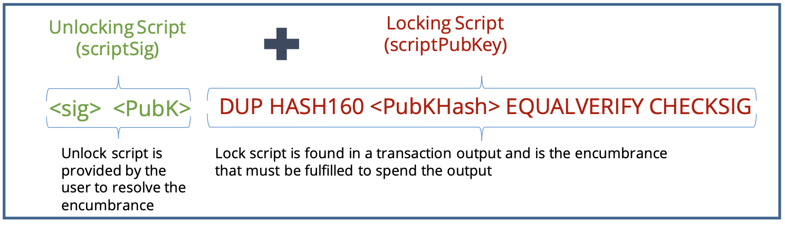
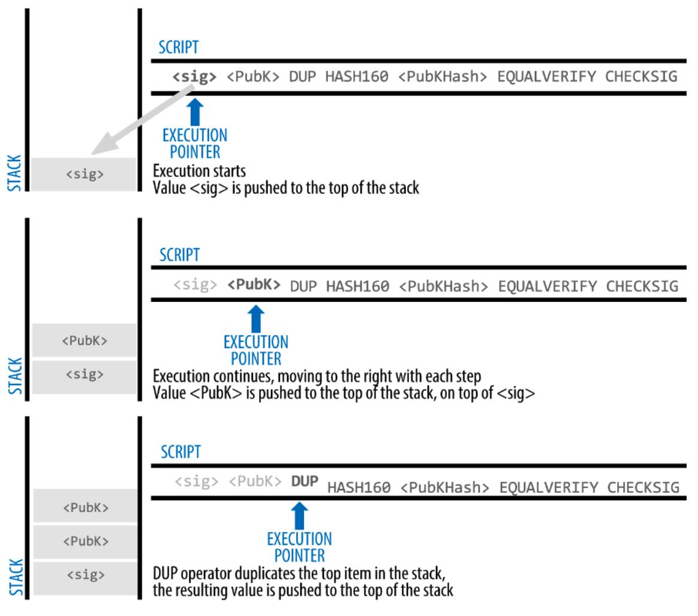
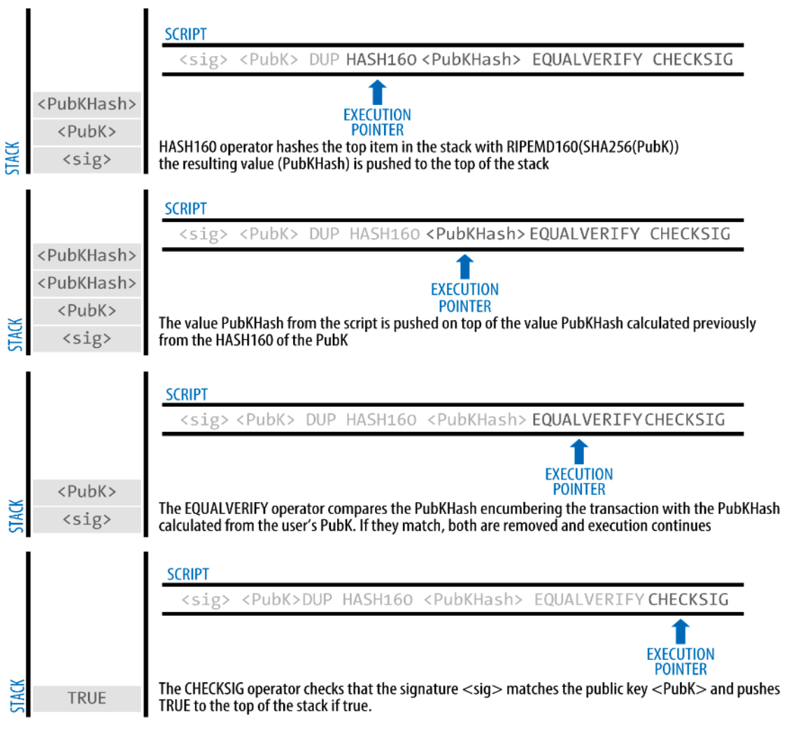

# Scripts in Bitcoins

## Scripts in Bitcoins

### Bitcoin Script: Features

All Bitcoin transactions have **scripts embedded into their inputs and outputs**

Bitcoin Script&#x20;

* a **stack-based** programming language like `Forth`
* a **list of instructions** are recorded with each transaction
* describes how the person can access the Bitcoins if they want to spend them
* **turing incomplete**: cannot have looping conditions in the code

#### Bitcoin Script Instructions

* operations in Bitcoin are composed of **opcodes**
  * 256 opcodes; 15 are disabled; 75 are reserved
  * opcodes have the following: constants, flow control, stack, bitwise logic, arithmetic, crypto, locktime, pseudo-words, reserved words
* each instruction is given one byte

### Bitcoin Script: An Example

Scenario: Joey verifies the transaction is initiated by Ross

**Bitcoin transfers scripts instead of signature and the public key**

<figure><figcaption></figcaption></figure>

Joey can spend the Bitcoins only if **both the scripts return true after execution**

### Bitcoin Script: Construction

* transaction input → scriptSig → unlocking script
* transaction output → scriptPubKey → locking script

unlocking process

* A hash is generated by duplicating the receiver’s public key and hashing it
* This new hash is then compared with the public key hash included in the received transaction
* If the two hashes match, the receiver’s private key can be used to unlock the transaction, making the funds available in their wallet

<figure><figcaption>
Figure from “Mastering Bitcoin” book, Chapter 6
</figcaption></figure>

### Evaluating Bitcoin Transaction Script

a step-by-step execution of the combined script which will **prove this is a valid transaction**

<figure><figcaption>
Figure from “Mastering Bitcoin” book, Chapter 5
</figcaption></figure>

<figure><figcaption>
Figure from “Mastering Bitcoin” book, Chapter 5
</figcaption></figure>

╰┈➤ since the script return true, the transaction is considered valid

