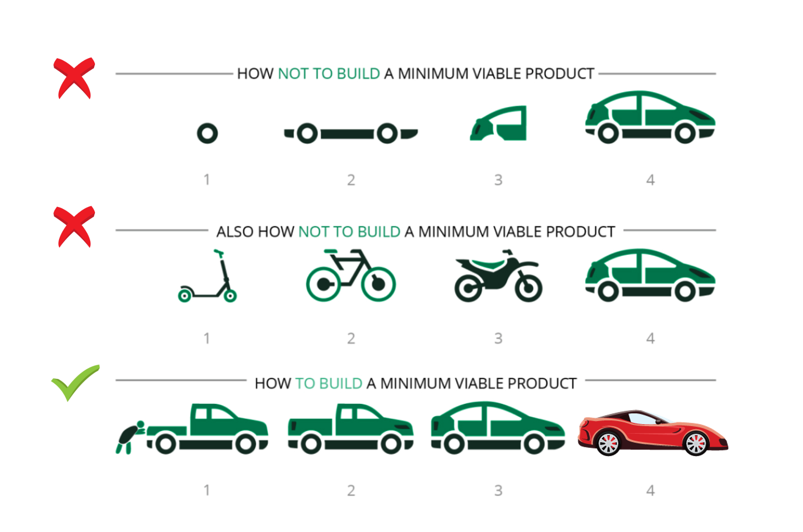

# Moving from PoC to MVP

## Moving from `PoC` to `MVP`

> Refining & expanding the initial concept to create a working version of the blockchain application with essential features, ready for testing and user feedback.

**Focus:**

* developing a more robust and functional version of the system
* **scaling** the solution while incorporating user/stakeholder feedback


**Engaging stakeholders**&#x20;

* too early (before needs analysis) or&#x20;
* too late (after MVP launch)&#x20;

can lead to **misaligned objectives**.



#### Stakeholder Alignment: **`build alignment up front`**  approach

* slower at the start&#x20;
* save time during development by ensuring everyone is on the same page


### MVP

> **MVP**: Minimum Viable Product
>
> simplified yet operational version of the application, encompassing core features that address the identified problem statement
>
> **MUST be a complete usable/working product at each version release**; need not to be the ideal; no need for polished user interfaces
>
> prioritizes **core functionalities** and **feedback** mechanisms
>
> ✔ a tangible and user-ready product
>
> ✔ showcase the practicality and viability of the application
>
> ✔ showcase alignment of features with user needs&#x20;
>
> ✔ offers a taste of the full potential of the solution to stakeholders, investors, end-users
>
> purpose: attract further development resources or funding

<figure><figcaption>
Source: <a href="https://york.ie/blog/how-to-build-a-minimum-viable-product/">https://york.ie/blog/how-to-build-a-minimum-viable-product/</a>
</figcaption></figure>

An MVP should:

1. Be a complete and usable product at every release
2. Deliver something of business value at each release
3. Incrementally add more value with each release


**MVP** isn’t about perfection—it’s **about scalability and user feedback.**


### PoC → MVP Considerations:


In general, the addition of blockchain into the solutions development process should not substantially change much.


* Has a **Product Roadmap** been developed and agreed upon by all stakeholders?
  * Have Functional Requirements been prioritized by the business?
    * Consider using the **`MoSCoW` Prioritization framework**
      * Must Have
      * Should Have
      * Could Have
      * Will Not Have
* **Time-tested principles** for successful development and delivery should be adhered to
* When developing on platforms where **Smart Contracts** are **stored on-chain**, be **careful** of your **release cadence**!
  * How are old releases managed?
  * How are new releases communicated to the rest of the application stack?
* **Change Management Process**
  * Critical to define **BEFOREHAND**!
    * Especially when taking **consortium approach**!
  * What happens when conflicting changes are submitted?
    * What is the official Change Acceptance process?
* **New Product Release Process**
  * How are changes, upgrades, new versions, and new releases managed?
  * How are these activities communicated to customers, users, product owners, and stakeholders
  * Is there a release sign-off process?
  * What QA processes and checks are required for release?
  * How are releases rolled back?
  * Are old releases still supported?
  * How are permanent old releases managed?
    * on pure blockchain platforms like Ethereum
* **New Platform Release Process**
  * When a platform component has a major version release, how will this be handled?
    * immediate upgrade | evaluation process | upgrade schedule | ...
  * What about minor releases?
  * What is the official process for dealing with breaking upgrades?
    * How are rollbacks performed?
  * What about tooling updates?
* **Team Communications**
  * How are team members alerted to changes or updates?
  * How do team members communicate with each other?
  * Where do team members go for help?
    * Technical help
    * Project Management help
    * Other help

### ✅ Best Practices: Transitioning to MVP

* clearly defined objectives
  * aligns with initial problem statement & use case
  * clear goals MVP should achieve
  * clear success criteria MVP should achieve
* feature prioritization
  * **MVP should be lean and focused**
  * avoid feature bloat
* usability & user experience&#x20;
  * system should be intuitive & user-friendly
* scalability considerations&#x20;
  * plan for the ability to accommodate a larger user base and increased transaction volume in future iterations
* feedback collection
  * establish a mechanism to collect feedback from a select group of users or stakeholders&#x20;
  * use their input to refine /enhance MVP based on real-world usage
* security and compliance&#x20;
* testing & quality assurance&#x20;
  * implement a robust quality assurance process to eliminate bugs & inconsistencies
* documentation & training
  * ensure that relevant parties understand how to use and interact with the MVP
* iterative development
  * be prepare for further iterations based on user feedback & changing requirements
  * adopt an **agile approach** to development
* resource planning
  * resources for transitioning to MVP
    * development teams
    * infrastructure
    * funding
* engagement & communication&#x20;
  * open & transparent communication with stakeholders (investors, users)
  * keep them informed about progress, challenges, upcoming milestones
* market validation
  * use the MVP to validate the project's market viability & potential user adoption

