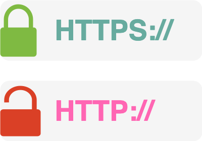
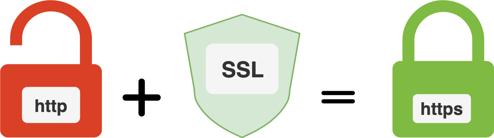

# HTTPS

## HTTPS

<table data-header-hidden><thead><tr><th width="172.86328125"></th><th></th></tr></thead><tbody><tr><td>

<figure><figcaption></figcaption></figure>
</td><td>

<figure><figcaption></figcaption></figure>
</td></tr></tbody></table>

* **Client request:** the user navigates to www.example.com
* **SSL/TLS handshake:** the server responds with a digital certificate
* **Verification:** the browser checks the certificate's validity, including whether a trusted CA issued it and if it matches the requested domain
  * the certificate is verified against a trusted CA
* **Secure connection:** upon successful verification, the server establishes secure communication and allows encrypted data transmission

[#secure-communication-ssl-and-tls](encryption/encryption-and-decryption/asymmetric-encryption/asymmetric-encryption-use-cases-applications.md#secure-communication-ssl-and-tls "mention")

[#ssl-tls](encryption/encryption-techniques-for-data-in-transit/#ssl-tls "mention")

