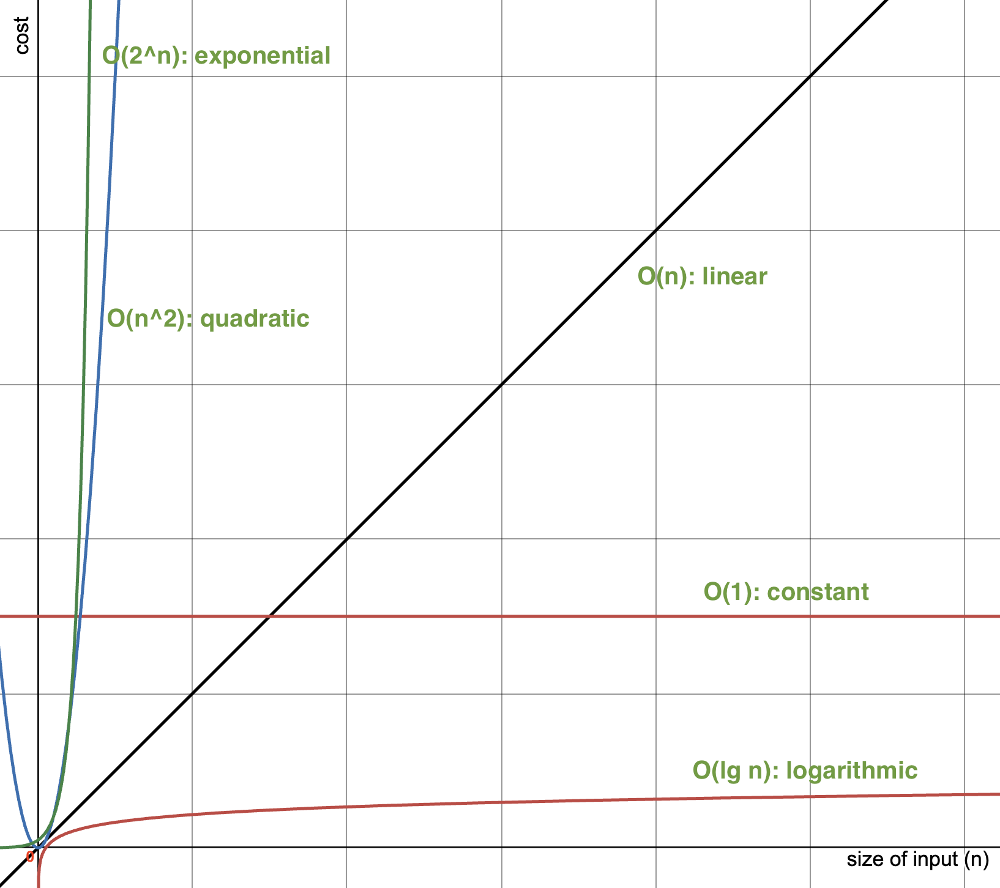
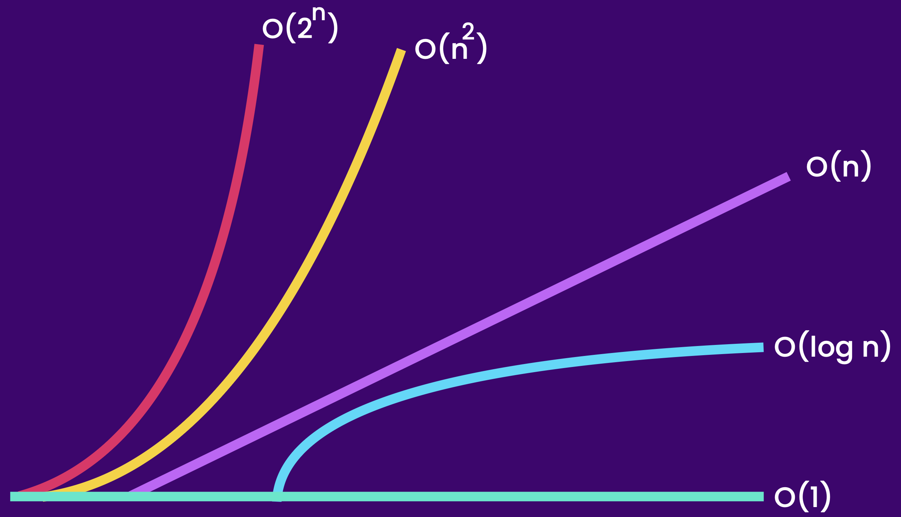

# The Big O Notation

## Big O Notation

> **Big O Notation**:
>
> **— used to describe the performance of an algorithm —**&#x20;
>
> * helps to determine if a given algorithm is scalable or not&#x20;
> * whether the algorithm scale well as the input grows really large


**Big O Notation**: Mathematical notation that describes&#x20;

&#x20;        **the limiting behavior of a function**&#x20;

&#x20;        when the argument tends towards a particular value or infinity.

— wikipedia —&#x20;


#### Use-case Example: Array or Linked List ?

<figure><figcaption></figcaption></figure>

Accessing an `array` element with array index is super fast, but arrays has a fixed length.

If you want to constantly add or remove items, then array need to be resized (which includes creating a new array); and this will be costly as the input size gets very large.

If we have to constantly add or remove items, then we can use a `Linked List`. A Linked List can grow or shrink quickly; but accessing an element in linked list by index is slow.

╰┈➤ Thus, **Big O** notation is important for **determining the performance** of these algorithms,&#x20;

╰┈➤ allowing us to **identify which data structure best addresses a given requirement.**


<figure><figcaption><p>Complexity Comparison Graph</p></figcaption></figure>


<figure><figcaption><p>Complexity Comparison For Easy Understanding</p></figcaption></figure>

### **Time Complexity**

**— runtime complexity —**&#x20;

* an approximation of the cost of an algorithm in terms of execution time, relative to it's input size
* don't care about the number of operations
* we only want to know how much an algorithm slows down as the input grows larger&#x20;


### Space Complexity

* an approximation of the cost of an algorithm in terms of space it needs, relative to it's input size
* we only look at the additional space that we should allocate relative to the size of the input

#### Example:

```java
public void greet(String[] names) {
    for (int i = 0; i < names.length; i++) {
        System.out.println("Hi " + names[i]);
    }
}
```

Here,

* we are declaring a loop variable `i`; this is independent from the array size of the input
  * whether the input array has 10 or 1M elements,&#x20;
  * this method will only allocate some additional memory for this loop variable i &#x20;

╰┈➤ So, this takes `O(1)` space.

```java
public void greet(String[] names) {
    String[] copy = new String[names.length]; // --- A --> O(n) space
    
    for (int i = 0; i < names.length; i++) {
        System.out.println("Hi " + names[i]);
    }
}
```

Here,&#x20;

* @ line A, we are creating a new array which is same in size as the input array&#x20;
  * the space complexity of this array -> O(n)
  * the more items in the input array, the more space array `copy` going to take
  * this is in direct proportion to the size of the input

╰┈➤ So, the space complexity of this method **➜ O(n + 1)** **➜ O(n)**


### Trade-Off Between Time & Space


In real world, we want our applications to be

* super fast,
* scalable, and
* take minimum amount of memory.

But this ideal scenario doesn't occur.

Most of the time, we have to do a **trade-off between saving time & saving space**.


E.g: If we are developing an app for small mobile device, we have limited space.&#x20;

* In this case, we have to optimize for space, as scalability is not a big factor.
* Only one user is going to use mobile application at that moment, not a million users.


## O(1)

> **O(1)** ➜ cost of the algorithm is a **constant**&#x20;
>
> * constant time
> * constant space


[examples-o-1.md](examples-o-1.md)



## O(n)

> **O(n)** ➜ cost of the algorithm **increases/grows linearly** in direct relation the input size
>
> * a linear curve grows at the same rate


[examples-o-n.md](examples-o-n.md)



## O(n<sup>2</sup>)

> **O(n**<sup>**2**</sup>**)** ➜ cost of the algorithm **increases/grows quadratically** in direct relation the input size
>
> * a quadratic curve grows in an increasing rate


[examples-o-n-2.md](examples-o-n-2.md)



## O(lg n)

> **O(lg n)** ➜ cost of the algorithm **increases/grows logarithmically** in direct relation the input size
>
> **— we reduce our work by half in every step —**&#x20;
>
> * the growth of a logarithmic curve decreases/slows down as input size grows starting from a certain point
> * therefore, algorithm that runs in logarithmic time is more efficient & more scalable than an algorithm that runs in linear or quadratic time


[examples-o-lg-n.md](examples-o-lg-n.md)



## O(2<sup>n</sup>)

> **O(2**<sup>**n**</sup>**)** ➜ cost of the algorithm **increases/grows exponentially** in direct relation the input size
>
> * an exponential curve grows faster and faster as input size grows
> * an algorithm that runs in an exponential time is not scalable at all; it could become very slow very soon as input size grows


