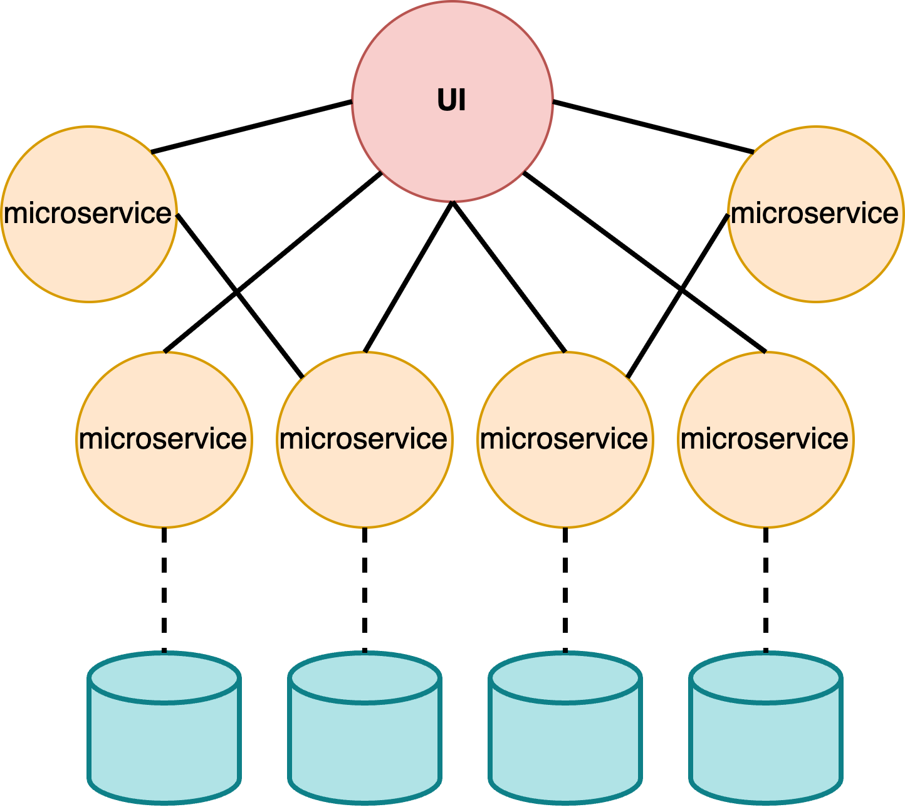

# Microservices

## Microservices Architecture

<figure><figcaption></figcaption></figure>

*   Application is broken down into&#x20;

    * **small**,
    * **autonomous services**,
    * **each handling a specific function**

    like

    * user authentication,&#x20;
    * product catalog,
    * payment processing.

* **Each microservice owns its database**
  * e.g:&#x20;
    * `MongoDB` for user data
    * `PostgreSQL` for transactions
    * communicating via **APIs** (`REST`, `gRPC`) or **message queues**

#### Challenges

* distributed transactions
* monitoring complexity

## Benefits

* offers scalability&#x20;
* independent deployment
* independent scaling, updates
* technology diversity
  * e.g: Python for one service, Java for another
* fault isolation
* cloud ready
* grater flexibility
* fast time to market & fast dev cycles
* small dev teams & code base
* easy to create CI/CD pipelines

## Implementation

### Frameworks

* `Spring Boot (Java)` with `Spring Cloud` for service discovery
* `Flask (Python)` with `gRPC` for high-performance communication

### Tips

* `Docker` to containerize services&#x20;
* `Kubernetes` for container orchestration
* Monitoring: `Prometheus`, `Grafana`

## Use-cases

Online Order Delivery System

<figure><figcaption>
Example of Mocroservices Architecture
</figcaption></figure>

Ride-sharing app

* Ride-sharing app with separate services for ride matching, payment, and notifications.

### Netflix

microservices: recommendation engine, streaming service, user management&#x20;

used to

* isolates services from each other
* allow independent scaling&#x20;
* allow independent updates

