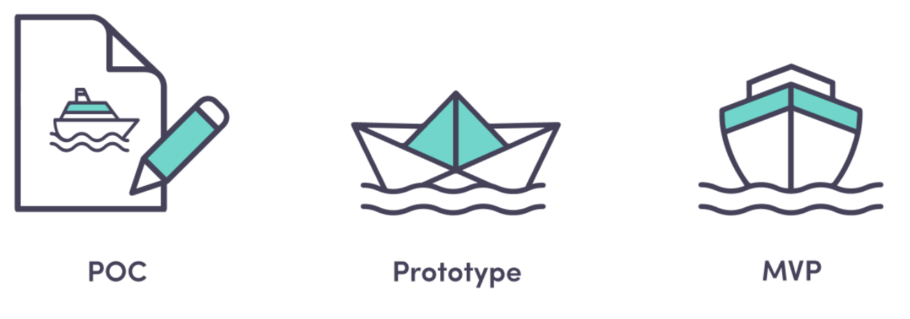

# PoC vs Prototype vs MVP

## `PoC` vs Prototype vs `MVP`

<figure><figcaption>
Source: <a href="https://www.amplifyn.com/post/poc-vs-prototype-vs-mvp-the-path-to-creating-a-promising-product">https://www.amplifyn.com/post/poc-vs-prototype-vs-mvp-the-path-to-creating-a-promising-product</a>
</figcaption></figure>

<table data-header-hidden><thead><tr><th width="107.46484375"></th><th width="197.10546875"></th><th></th></tr></thead><tbody><tr><td><strong>PoC</strong></td><td>Technical feasibility</td><td>
Is the idea feasible?

Can we build it?
</td></tr><tr><td><strong>Prototype</strong></td><td>Design &#x26; UX</td><td>What will the product look and feel like?</td></tr><tr><td><strong>MVP</strong></td><td>Market validation</td><td>
What are we initially taking to market?

Will users want it?
</td></tr></tbody></table>

### **Proof of Concept (PoC):**

* Purpose: Determines if an idea or technology is feasible to build.
* Scope: Usually a limited, internal project—a technical demo, simulation, whitepaper, or mini product.
* Focus: Technical validity and risk reduction, not usability or design.
* Audience: Internal stakeholders and technical teams; sometimes for investors.
* Outcome: Validates whether a solution can be created; not intended for end users or revenue.
* Example: Testing if a new AI model can process data real-time before building it into a product.

### **Prototype:**

* Purpose: Creates tangible, visual, or interactive representations of product ideas.
* Scope: Demonstrates user experience, workflow, and aesthetics; typically without a functioning backend.
* Focus: Design, feel, and user interaction; not a working product.
* Audience: Stakeholders, project teams, and sometimes test users for feedback.
* Outcome: Facilitates design validation and iteration before serious development starts.
* Example: Clickable mockups for a mobile app interface made in `Figma` or `Sketch`.

### **Minimum Viable Product (MVP):**

<figure><figcaption>
Source: <a href="https://york.ie/blog/how-to-build-a-minimum-viable-product/">https://york.ie/blog/how-to-build-a-minimum-viable-product/</a>
</figcaption></figure>

* Purpose: Launches the simplest functional version of the product with core features.
* Scope: Fully operational product, but only with essential features; built for release to real users.
* Focus: Market validation with actual usage and user feedback.
* Audience: Real customers and early adopters.
* Outcome: Tests business assumptions and product-market fit; helps guide further investments.
* Example: A basic web app that solves the main user problem and collects feedback.

