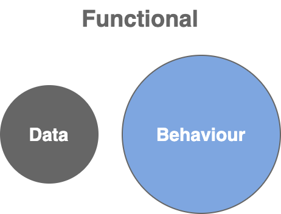

# Programming Paradigms

## Programming Paradigms&#x20;

<table data-header-hidden><thead><tr><th width="170.5859375"></th><th width="310.421875"></th><th></th></tr></thead><tbody><tr><td><strong><code>Procedural</code></strong></td><td><ul><li>about procedures &#x26; function calls</li><li>
have bunch of 
<ul><li><strong>variables</strong></li><li>functions called <strong>procedures</strong></li></ul></li></ul></td><td></td></tr><tr><td><strong><code>Functional</code></strong></td><td><ul><li>🔥 [popular]</li><li>assume that <strong>data</strong> <strong>and</strong> <strong>behaviour</strong> are fundamentally <strong>different</strong> and keep them separate</li></ul></td><td>

<figure><figcaption></figcaption></figure>
</td></tr><tr><td><strong><code>Object-Oriented</code></strong></td><td><ul><li>🔥 [popular]</li><li>everything based on the concept of <strong>objects</strong> </li><li>bring together data and methods that operate on a single object</li></ul></td><td>

<figure><figcaption></figcaption></figure>
</td></tr><tr><td><strong><code>Imperative</code></strong></td><td><ul><li>Implementing logic using <strong>instructions</strong></li><li>statements specify <strong><code>how</code></strong> something should be done</li></ul></td><td>
Imperative Style
<ul><li><strong><code>for</code></strong> loops</li><li><strong><code>if/else</code></strong> statements</li><li><strong><code>switch/case</code></strong> statements</li></ul></td></tr><tr><td><strong><code>Declarative</code></strong></td><td></td><td></td></tr><tr><td><strong><code>Event-Driven</code></strong></td><td></td><td></td></tr><tr><td><strong><code>Aspect-Oriented</code></strong></td><td></td><td></td></tr><tr><td><strong><code>Logic</code></strong></td><td></td><td></td></tr></tbody></table>

### No paradigm works best in all situations...

> **No paradigm works best in all situations**.
>
> ╰┈➤  depends on the **problem** you are trying to solve, it's **context** and **budget**.

In a **`single application`**, you can use **`multiple paradigms`**.

&#x20;      e.g:  event-driven in one part

&#x20;              functional/ object oriented on other parts

### Languages that support Single Paradigm and Multiple Paradigms

* Some languages support single paradigm.
* Some languages support multiple paradigms.

|  Single Paradigm | Multiple Paradigms |
| :--------------: | :----------------: |
| Small Talk (OOP) |       Python       |
|                  |        Ruby        |
|                  |        Java        |
|                  |     JavaScript     |

## Imperative Vs Functional Vs Declarative Programming

|          Imperative         |                                                                                               Declarative/ Functional                                                                                              |
| :-------------------------: | :----------------------------------------------------------------------------------------------------------------------------------------------------------------------------------------------------------------: |
| **`How`** it should be done |                                                                                             **`What`** need to be done                                                                                             |
|                             | 
<strong>SQL</strong> -> example of declarative language -- We write a query to express what need to get from the database. -- We don't write the actual logic for pulling out data and filtering it. 
 |
|                             |                                                 **`Functional`** programming is special type of `declarative` programming; but it brings some additional concepts.                                                 |

## 📌 Choosing a Programming Paradigm - Basic Guideline

<kbd>**No hard  & fast rule**</kbd>

OOP &#x20;

╰┈➤ better choice for creating graphical user interfaces and games

Functional&#x20;

╰┈➤ Makes more sense for applications that require

&#x20;           ⤷ high level of reliability or

&#x20;           ⤷ problems that involve messages being passed around and getting transformed along the way.

## More on Procedural Programming


[procedural-programming.md](procedural-programming.md)


## More on Object-Oriented Programming


[oop-object-oriented-programming.md](oop-object-oriented-programming.md)


## More on Imperative Programming


[imperative-programming.md](imperative-programming.md)


## More on Declarative Programming


[declarative-programming.md](declarative-programming.md)


