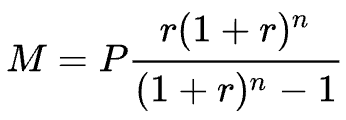
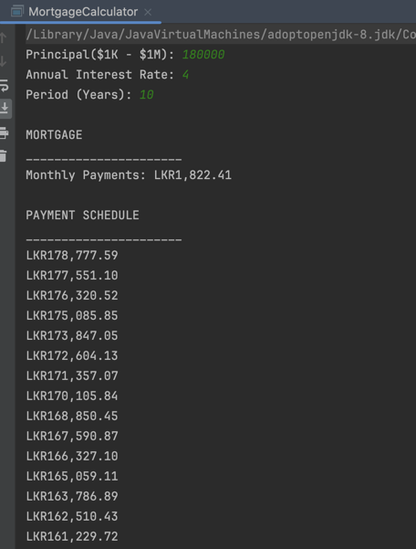
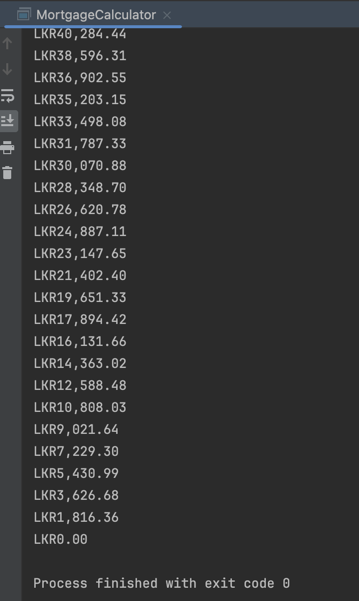

# Demonstrate different programming paradigms via a Mortgage Calculator

## About Mortgage Calculator

Mortgage is calculated as follows.

Here,
* **M** is the monthly payment.
* **P** is the principal.
* **r** is the monthly interest rate, calculated by dividing the annual interest rate by 12.
* **n** is the number of payments (the number of months user will be paying the loan).

### Command line Interface of Mortgage Calculator

